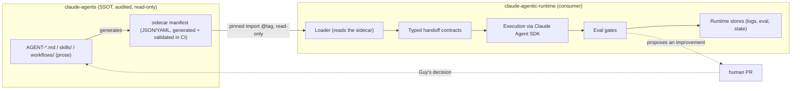

# Architecture — `claude-agentic-runtime`

> Architecture view of the agentic runtime. Detailed decisions in [`docs/adr/`](adr/). Full scoping: [`docs/note_cadrage_poc.md`](note_cadrage_poc.md).

## Guiding principle

The runtime **executes** a declarative catalog it does not own. The **dependency direction is one-way** and **read-only**.

- **Solid line**: execution flow and read-only dependency.
- **Dashed line**: feedback — **only through a human PR** (ADR-0005), never an automatic write.

## Layers

| Layer | Role | Built? |
|---|---|---|
| **Catalog** (`claude-agents`) | SSOT: roles, skills, workflows + sidecar | Existing (read-only) |
| **Loader** | Sidecar → Claude Agent SDK definitions | To build (block 0) |
| **Contracts** | Typed I/O between workflow steps | To build (block 1) |
| **Eval gates** | Quality guardrails on agent outputs | To build (block 2) |
| **Execution** | Sub-agents, tool routing, state, MCP | **Provided by the Claude Agent SDK** |

## Invariants (see ADR)

1. **Read-only** consumer of the catalog — [ADR-0001](adr/0001-consommateur-read-only.md)
2. **Pinned versioned** import (exact tag, explicit bump) — [ADR-0002](adr/0002-import-epingle-versionne.md)
3. **Sidecar** owned by the catalog — [ADR-0003](adr/0003-sidecar-propriete-catalogue.md)
4. **Propagation guarded** by eval gates + contract validation — [ADR-0004](adr/0004-propagation-gardee-eval-gates.md)
5. **Feedback through a human PR** — [ADR-0005](adr/0005-feedback-par-pr-humaine.md)

## Architecture description (ISO/IEC/IEEE 42010:2022)

Per the architecture-description standard (chosen framework, see [ADR-0006](adr/0006-referentiels-qualite.md)).

### Stakeholders & concerns
| Stakeholder | Primary concern |
|---|---|
| **Guy (owner / architect)** | Quality, maintainability, portfolio signal, anti-over-engineering |
| **`claude-agents` catalog** | Never be mutated by the runtime; stay audited |
| **External technical reviewer** | Readable decisions, rigor, honest guarantees |
| **Execution (Agent SDK)** | Clear input/output contracts between steps |

### Viewpoints
| Viewpoint | Concerns addressed | View (where) |
|---|---|---|
| **Dependency** | One-way runtime→catalog, read-only | Diagram above + [ADR-0001](adr/0001-consommateur-read-only.md) |
| **Data** | Catalog/sidecar quality (ISO 25012) | Sidecar + JSON Schema (block 0) |
| **Execution** | Orchestration of a workflow backbone (e.g. WF-001) | Layers above |
| **Governance** | Guarded propagation, feedback through a human PR | Propagation § + [ADR-0004](adr/0004-propagation-gardee-eval-gates.md)/[0005](adr/0005-feedback-par-pr-humaine.md) |

## Propagation model (Dependabot/Renovate-like)

New catalog version → CI validates (contracts + eval gates) → bump PR if green (*fail-closed* if red) → **human merge**. Automation checks, the human decides.

---

> Document produced with **Claude Opus 4.8** (model in use, 2026-06-03).
