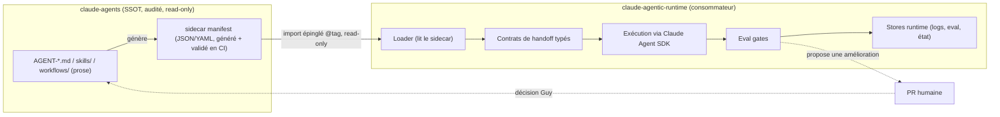

# Architecture — `claude-agentic-runtime`

> Vue d'architecture du runtime agentique. Décisions détaillées dans [`docs/adr/`](adr/). Cadrage complet : [`docs/note_cadrage_poc.md`](note_cadrage_poc.md).

## Principe directeur

Le runtime **exécute** un catalogue déclaratif qu'il ne possède pas. La **direction de dépendance est unique** et **read-only**.

- **Trait plein** : flux d'exécution et dépendance read-only.
- **Trait pointillé** : feedback — **uniquement par PR humaine** (ADR-0005), jamais d'écriture automatique.

## Couches

| Couche | Rôle | Construit ? |
|---|---|---|
| **Catalogue** (`claude-agents`) | SSOT : rôles, skills, workflows + sidecar | Existant (read-only) |
| **Loader** | Sidecar → définitions Claude Agent SDK | À construire (brique 0) |
| **Contrats** | I/O typés entre étapes de workflow | À construire (brique 1) |
| **Eval gates** | Garde-fous qualité sur sorties d'agents | À construire (brique 2) |
| **Exécution** | Sub-agents, routing d'outils, état, MCP | **Fourni par le Claude Agent SDK** |

## Invariants (voir ADR)

1. Consommateur **read-only** du catalogue — [ADR-0001](adr/0001-consommateur-read-only.md)
2. Import **épinglé versionné** (tag exact, bump explicite) — [ADR-0002](adr/0002-import-epingle-versionne.md)
3. **Sidecar** propriété du catalogue — [ADR-0003](adr/0003-sidecar-propriete-catalogue.md)
4. **Propagation gardée** par eval gates + validation de contrats — [ADR-0004](adr/0004-propagation-gardee-eval-gates.md)
5. **Feedback par PR humaine** — [ADR-0005](adr/0005-feedback-par-pr-humaine.md)

## Description d'architecture (ISO/IEC/IEEE 42010:2022)

Conformément au standard de description d'architecture (référentiel retenu, cf. [ADR-0006](adr/0006-referentiels-qualite.md)).

### Parties prenantes & préoccupations
| Partie prenante | Préoccupation principale |
|---|---|
| **Guy (owner / architecte)** | Qualité, maintenabilité, signal portfolio, anti-usine-à-gaz |
| **Catalogue `claude-agents`** | Ne jamais être muté par le runtime ; rester audité |
| **Évaluateur technique externe** | Lisibilité des décisions, rigueur, honnêteté des garanties |
| **Exécution (Agent SDK)** | Contrats d'entrée/sortie clairs entre étapes |

### Points de vue (viewpoints)
| Point de vue | Préoccupations adressées | Vue (où) |
|---|---|---|
| **Dépendance** | Sens unique runtime→catalogue, read-only | Diagramme ci-dessus + [ADR-0001](adr/0001-consommateur-read-only.md) |
| **Données** | Qualité du catalogue/sidecar (ISO 25012) | Sidecar + JSON Schema (brique 0) |
| **Exécution** | Orchestration du backbone d'un workflow (ex. WF-001) | Couches §ci-dessus |
| **Gouvernance** | Propagation gardée, feedback par PR humaine | §propagation + [ADR-0004](adr/0004-propagation-gardee-eval-gates.md)/[0005](adr/0005-feedback-par-pr-humaine.md) |

## Modèle de propagation (Dependabot/Renovate-like)

Nouvelle version catalogue → CI valide (contrats + eval gates) → PR de bump si vert (*fail-closed* si rouge) → **merge humain**. L'automatisation vérifie, l'humain décide.

---

> Document élaboré avec **Claude Opus 4.8** (modèle en cours d'utilisation, 2026-06-03).
